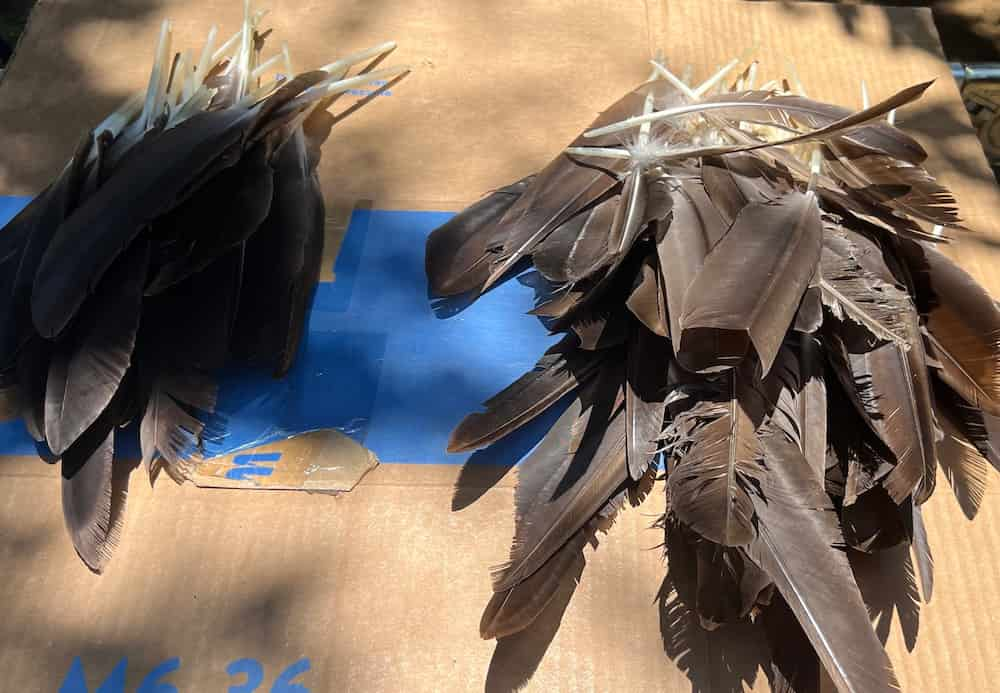
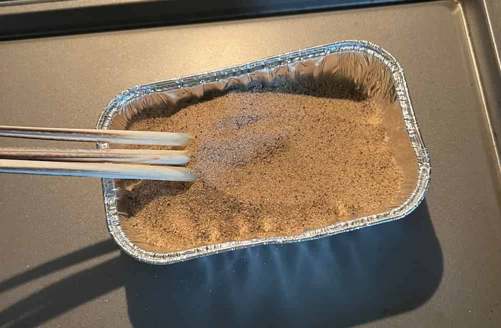
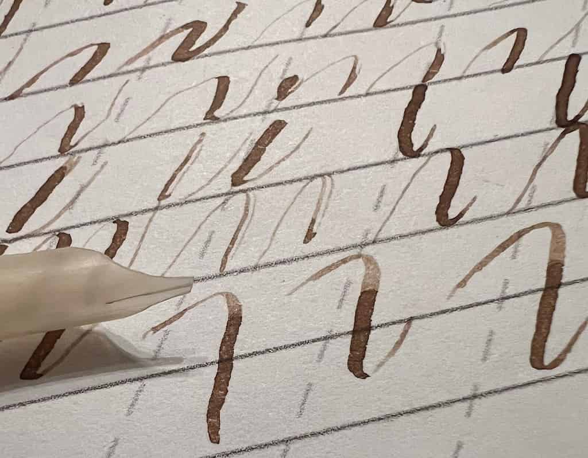

Many historical scripts and modern variants owe much of their form and technique
to the quill pen and its capabilities. With this in mind, I took up the
challenge of learning to make quills from scratch last summer. It was not easy,
nor yet very successful, but it has been incredibly valuable and enjoyable. If
you have any interest in historical penmanship, working with quills is relevant
and fascinating. This is an account of my first attempts nearly a year ago, and
could also serve as a guide to getting started with this art.

<!--toc:start-->
- [Part 1: Harass the Waterfowl](#part-1-harass-the-waterfowl)
- [Part 2: Preparation](#part-2-preparation)
- [Part 3: Clarification](#part-3-clarification)
- [Part 4: Cutting](#part-4-cutting)
- [Next Steps & Further Reading](#next-steps--further-reading)
<!--toc:end-->

## Part 1: Harass the Waterfowl

There is an infestation of Canada Geese in my local park. Normally, I would
complain. However, goose feathers are widely regarded as the prime source for
quills. Geese molt annually in the summer, dropping their flight feathers. The
few most external of these, known as the primaries, are what we want for quills
due to their size and strength.[^1] A couple of trips around the ponds in the
blistering Texas heat were enough to stock me with around one hundred feathers
to work with.

If you are lucky enough to have access to a park like mine, it should go
without saying that you should only collect feathers that can be reached
without disturbing the birds. You should also check your local laws concerning
the collection of feathers. They can carry pests and diseases, so be careful
and clean. For each feather, you'll want to check the barrel (the bottom,
featherless part of the shaft) for cracks or misshapenness and leave any of
those behind.

Most people probably don't have access to molting geese, so I'll mention that
John Neal Books sells
["White Goose Quills, Uncut Uncured"](https://www.johnnealbooks.com/product/white-goose-quills-uncut-uncured)
for $1.50 each as of 2026, if you're in the United States. I would avoid
buying the pre-cut or pre-cured feathers, since you won't be able to control
the process. Turkey feathers are also used for quills and should be available
online, though I haven't used them.

## Part 2: Preparation

If you're collecting feathers from molting birds in the park, you may want
to clean your feathers before continuing. Since I collected so many, I washed
them in a large batch with a bucket of soapy water and left them to dry in the
sun. This is not strictly necessary for the making of a decent quill, but I
personally want my writing tools to be free of dirt, grime, and goose poop.

To avoid making unwieldy quills, I cut away some of the barb end, leaving around
eight inches. Wire cutters gave me the cleanest cuts. I then trimmed the end
of the barrel enough to expose the inside of the feather for cleaning. With a
small crochet hook or similar implement, you can scoop out the inner membrane of
the feather.

The next step is to remove the barbs. Although a voluminous and flowing quill
is appealing, the barbs, especially those near the hand, can be a nuisance. If
you want to keep some barbs anyway, you should at least remove anything near
your grip. It is common to see one side of the feather clipped away, or a small
amount of barbs left around the top of the feather. They can sometimes be pulled
away easily, though you may need some assistance with a knife. I found that as
I tore away the barbs, I would sometimes pull a 'hangnail' into the barrel. To
keep it clean for writing, snip the strand with a knife when this happens.

## Part 3: Clarification

So far, it might seem that making a quill is cake. The curing process, sometimes
called clarification, changes things.

The natural texture of the feather is too soft for writing. A quill cut from
an uncured feather will dull and lose shape much too quickly to be usable for
reliable and consistent work. The solution is to dry the feather, making it
harder and more brittle. One easy method involves leaving the quill to dry
naturally in the sun or a warm place. A quicker and more systematic method
called tempering involves inserting the feathers into hot sand for up to a few
minutes. There are other methods, notably dutching, which uses a heated metal
rod inserted within the barrel, but tempering with hot sand is what was most
accessible for me and the most common.

Before heating the sand, I soaked the quills in a cup of water the night before.
I read that this is necessary for the tempering to work well, but I haven't
tested this.[^2]

Donald Jackson, whose excellent guide I've followed, recommends using the finest
possible sand. I had moderate success with a coarse gardening sand anyway.
Two to three inches in a shallow dish or pot on the stove or in the oven,
respectively, works well. Use pure metal cookware without coatings, since these
may burn from the dry heat. It does not smell pleasant. I heated the sand to
around 300°F in an aluminum dish in the oven. 

The soaking feathers should be removed and dried. Cut a small (around 1 cm long)
angled opening into the end of the barrel to create a scoop. This will make it
easier to funnel sand into the feather. You may want to use a sharp knife for
precision instead of the wire cutters (more on knives in Part 4).

With the hot sand ready, use a spoon to fill the inside of the feather, then
insert the barrel into the sand. At 300°, I kept the feathers under the sand for
around two minutes. There is no single time and temperature to use, and this is
something that can only be discovered by experimentation. You are looking for
the barrel of the feather to become translucent and rigid. When we go to cut the
slit in Part 4, the now brittle feather should naturally split along its length.

While the feather is still warm from the sand, it may be possible to reshape the
barrel to be larger and flatter by inserting a metal rod or hook.[^3] This is
a component of Norman Brown's modern 'Dutching' technique. I have yet to make
an attempt, but it is high on my list of things to try, especially since goose
feathers tend to be elliptical with the minor axis parallel to the writing edge.
This limits the maximum width of the nib.

## Part 4: Cutting

Now that we have dried and hardened our feather, we only need to cut it into a
usable quill pen.

The tool of choice should be a small knife, thin and sharp. Ideally, we
could use a dedicated pen knife, like masters in the past. You can find
vintage or antique ones if lucky, or shop custom-made from [Yoke Pen
Company](https://www.yokepencompany.com/collections/quill-knives) and others. A
well-made pen knife has a large ergonomic grip, a curved blade, and one rounded
outer edge for smoother scooping cuts.[^4] For me, and actually the preference
of Paul Antonio, an X-Acto knife is a decent substitution, and saves time
otherwise spent sharpening.[^5]

Knife in hand, the first step is to cut a slit for ink flow. At this point, we
may be grateful for our hard work at the oven, as the brittle feather should
practically split itself. To determine where the slit should be placed, we
need to orient the feather correctly and see where it lies in the hand. On the
bottom side of the quill will be a line running the length of the shaft. Hold
the quill with that side facing down as if you were to write. Having identified
the writing edge, we want to insert our knife into the barrel with the blade
facing the top edge. Pushing the base of the blade into the upper edge of the
quill using the leverage against the bottom edge, split the feather. If it
cracks easily, straight, and clean, this is our sign that the tempering was
done well.[^6]

You can also skip this step and add the slit with a different method after
forming the shape of the pen. I haven't yet decided if I prefer one method to the other.

Continuing to form the shape of the quill, we will make three main cuts. When
I was learning these cuts, Jackson's guide was extremely helpful, so I'll be
utilizing a few of his most useful diagrams to illustrate my directions. And
because I can't do it well enough yet!

The first cut is a large scooping cut from the underside of the pen. Start
back around an inch and a half from the tip of the feather and cut down and
out through the length of the barrel. Observe the shape in the diagram, how the
scoop quickly levels out and then continues straight to the end. I have been
doing this as a push cut, but it could also be done as a pull. Jackson describes
using the latter, but it seems to me this might be more difficult to keep
straight, though perhaps more controlled. You could also make the cut straighter
at first and pare material away in multiple cuts to get the right shape. In any
case, the scoop is probably not going to make or break the quill, though the
rest will.

![Jackson Scoop Cut Diagram[^7]](quill-diagram-scoop.png
"The scoop cut ")

The next goal is to form the shoulders of the pen one at a time. The cut should
begin around one-fourth of the previous cut's length from the tip. With a paring
motion similar in shape to the scooping cut, carve away the outside of the
feather, narrowing towards the slit and ending nearly parallel to it. This is
the most difficult cut for me. I tend to cut too much and overshoot the slit.

![Jackson Shoulder Cuts Diagram[^8]](quill-diagram-shoulders.png
"Carving the shoulders---rotate with the knife at the start of the first
shoulder to find the matching point for the second ")

If the forming of the slit was skipped previously, we could instead introduce
it to the shaped quill now. With the end of the quill upside down on a hard
surface, we can crack the feather by pressing down with our knife. Jackson and
Brown call this the *guillotine* method. It reminds me of using a knife
to break up peanut brittle. This could be easier than trying to carve the pen
carefully around an existing slit, especially where too much pressure in the
wrong direction can easily cause the slit to widen or the tines to separate.

The final step, finishing the nib, is much less difficult. We want to flatten
the top and bottom of the writing edge by shaving away any jutting material. If
the edge is too round so that only the two ends of the arc touch the paper, the
edge is too broad. You should go back a step and cut more from the shoulders.
This is where reshaping the barrel might have been useful. Once we have the
desired width on a flush edge, rest the nib, inside down, on a solid surface.
Finish the nib with a single chop at a slight angle away and down from the
top of the quill. This gives a sharp and even writing edge for penning clean
letters.

Many adjustments to this process might be made for different writing conditions,
scripts, and goals. For example, we can cut a wider pen, which requires some
lengthening of the slit and sometimes a second slit entirely.[^9] We can make
the shoulders broader or narrower to adjust ink flow. You could even try to
make the tines thin and flexible, and in that case, good luck. A different ink
or paper may need a different pen, and no matter what conditions, you will need
to constantly sharpen and recut the pen.

There is no end to learning this skill once you start.

 

## Next Steps & Further Reading

The impetus for this project was not to make a tool for broad edge lettering
in the expected sense, but rather to gain insight into the traditional way
of writing roundhand. It is a common misconception that English Roundhand
and similar scripts were written with a pointed pen. Most writers of modern
"copperplate" or "roundhand" do use flexible pointed pens, but this is not
the traditional way. In reality, Roundhand was written with a unique rotation
between the edge and the corner of the quill. As described in the *Young Clerk's
Assistant*, first published ca. 1733:

>Make the Nib of your Pen for the Round & Round-Text Hands the breadth of the
>full Stroke---Make All Your Body-Strokes with the Full, & all Hair-Strokes
>with the corner of Your Pen. [^10]

Though my current results are nowhere near good enough for quality work, even my
worst quills give a fascinating hint of how to use this traditional technique.

As I continue to work on my quills, I hope to be able to write more about my
experiments and discoveries, especially in the context of Roundhand. I'd like to
explore Brown's dutching technique, test the guillotine method, and try to vary
the order of some of the steps. I've been wondering if I could cut the entire
shape of the quill before curing it and finish with the slit. These are things
to look out for in future posts.

If you're curious to learn more about the process, including more on ink and
paper choice, details on the curing and cutting process, and amazing diagrams,
please read Donald Jackson's article, "Preparation of Quills and Reeds."
This is easily the best source on the subject, and I've cited it frequently in
writing this. Equally rich are the vast number of copybooks from the 16th to
19th centuries, which sometimes contain diagrams or instructions. Happy studies!

<!-- footnotes -->

[^1]: Donald Jackson, "Preparation of Quills and
Reeds,"
in *The Calligrapher's Handbook*, ed. Heather Child (1986), 15--16.

[^2]: Jackson, 17.

[^3]: Jackson, 19.

[^4]: "Quills and Quill Knives," Patricia Lovett MBE,
[https://www.patricialovett.com/quills-and-quill-knives/](https://www.patricialovett.com/quills-and-quill-knives/).

[^5]: PAScribe, "How to cut a Quill," December 1, 2015, YouTube, 2:43--3:17,
[https://www.youtube.com/watch?v=QW3To0iuTpw&t=445](https://www.youtube.com/watch?v=QW3To0iuTpw).

[^6]: Jackson, 23--24.

[^7]: Jackson, illus. 10.
[(non-transparent)](./quill-diagram-jackson.jpg)

[^8]: Jackson, illus. 14--15.

[^9]: Jackson, 30.

[^10]: *The Young Clerk’s Assistant; Or, Penmanship Made Easy, Instructive
and Entertaining: Being a Compleat Pocket-Copy-Book, Neatly Engrav’d
for the Practice of Youth in the Art of Writing*. W. Lowndes, 1787.
https://books.google.com/books?id=GAVQAAAAYAAJ.
