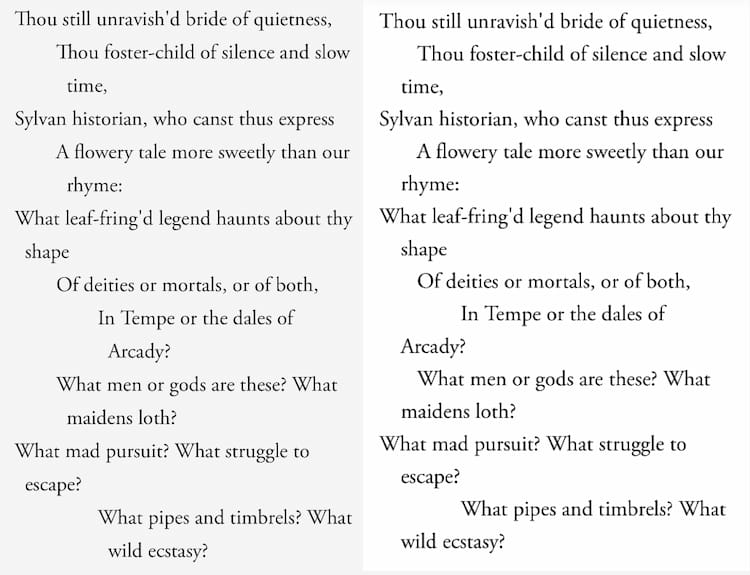

A poet might ponder for hours about when to end a line, how much to indent, or exactly where to add an extra space. When working in HTML and Markdown, respecting those structural components becomes a task.

There are two main issues when formatting web-based poetry, namely *whitespace stripping* and *text wrapping*.

I use Markdown through Hugo to write the posts for this website. When processed into HTML, all whitespace within or before a line is stripped. A poem written directly in Markdown will be pressed into a flat, left-aligned block.

Solving the whitespace stripping problem alone is simple. The poem can be kept in raw text within a page bundle and added to a post with a simple shortcode.

```go-html-template
{{ $name := .Get 0 }}

{{ $poem := .Page.Resources.GetMatch (printf "%s.txt" $name) }}
{{ $content := $poem.Content }}

<div class="poem poem--raw">{{ $content | safeHTML }}</div>
```

Styling the element as preformatted text, the poem is seen as written.

Once on the site, however, we might also have to deal with lines that are too long for the screen. The two best options are to keep the full length and allow horizontal scrolling, or to wrap the overflowing text to the beginning of a new line. The latter is more readable and user-friendly, but risks obscuring the original structure of the poem, especially if the text-wrap is poorly styled. The former option, however, is plain unpleasant. Nobody should have to scroll a poem to the left and right, unless it would ruin it to even consider breaking a line (consider concrete poetry, or experiments in form. In such cases, embedding an image might be better anyway).

In print, a common solution is to apply a hanging indent to overflowing lines. If the poem has complicated indentation, the hanging indent can be applied relative to the line's initial indentation.

```text
This is all one very very very very long  │ <- edge of content
 single line.                             │
    This is an indented line that is also │
      very long.                          │
```

Our previous shortcode logic falls short for this solution. Since the entire poem lives within a single block, we cannot style individual lines. Text wrapping in this context is limited to a single position. If an indented line wraps, it goes to the same spot as any other line, indented or not. This makes it hard to distinguish the original structure of the poem, since wrapped text may migrate:

```text
This is all one very very very very long  │ <- edge of content
 single line.                             │
    This is an indented line that is also │
 very long.                               │
```



The solution involves splitting the poem line by line and using CSS tricks to apply a relative hanging indent on text-wrap. The resulting HTML is decently semantic and convenient to style. No wonder [Poetry Foundation](https://www.poetryfoundation.org) employs something similar. In the end, poems can still be written and stored as plain text, but are processed into a more workable format.

Starting from our original shortcode, we'll add a new argument in case preformatted text is ideal.

```go-html-template
{{ $name := .Get 0 }}
{{ $mode := .Get 1 | default "wrap" }}

{{ $poem := .Page.Resources.GetMatch (printf "%s.txt" $name) }}
{{ $content := $poem.Content }}
```

Since we're writing and pasting poems in plain text, bold and italic font is not possible without a trick. We could write inline HTML in the poem, but this is cluttered and disruptive to a creative workflow. Instead, we can write pseudo-markdown \*\*bold\*\* and \*italic\* in the plain text, and process it into HTML with regex.

```go-html-template
<!-- convert markdown-style bold and italic -->
{{ $content = replaceRE `\*\*(.+?)\*\*` `<strong>$1</strong>` $content }}
{{ $content = replaceRE `\*(.+?)\*` `<em>$1</em>` $content }}
```

This logic is limited and will break with nested emphasis. Or any actual use of asterisks. If I ever need bold-italic or find a great poem that puts the asterisk to use, I'll have some revisions to make.

The next step is to split the poem into lines. As we loop through the lines, we first check if the line is a stanza break by verifying if it is empty after trimming whitespace. Stanza breaks are given an individual class for styling.

```go-html-template
{{ if eq $mode "wrap" }}
  {{ $lines := split $content "\n" }}
  <div class="poem poem--wrap">
    {{ range $lines }}
      <!-- trim whitespace -->
      {{ $trimmed := strings.TrimSpace . }}  
      {{ if eq $trimmed "" }}
        <div class="stanza break"></div>
```

Non-empty lines are then processed by counting and trimming leading whitespace. All whitespace is counted equally for simplicity. The cleaned line is then inserted into a line element with a CSS variable of the amount of indentation.

```go-html-template
      {{ else }}
        <!-- count indentation whitespace-->
        {{ $m := findRE `^(\s*)` . }}
        {{ $indent := 0 }}
        {{ if gt (len $m) 0 }}
          {{ $indent = len (index $m 0) }}
        {{ end }}

        <!-- remove indentation whitespace from string -->
        {{ $clean := replaceRE `^\s+` "" . }}
        <!-- line w/ indentation count var-->
        <div class="line" style="--indent: {{ $indent }}ch">{{ $clean | safeHTML }}</div>
      {{ end }}
    {{ end }}
  </div>
```

Lastly, we'll leave the original shortcode logic as an option.

```go-html-template
<!-- keep for ascii form poetry? -->
{{ else }}
  <div class="poem poem--raw">{{ $content | safeHTML }}</div>
{{ end }}
```



Now that a poem can be processed with the shortcode, what's left is simply styling our classes.

```css
.poem--raw {
  white-space: pre;
  overflow-x: auto;
}

.poem--wrap .line {
  margin: 0;
  white-space: pre-wrap;

  /* indent all lines (calculated + 1ch) */
  padding-left: calc(var(--indent, 0ch) + 1ch);  
  text-indent: -1ch; /* only first line comes back 1ch */
}
```

When a poem is processed 'raw', we want a simple preformatted text block, which preserves all whitespace and forces overflowing text to extend beyond the display. The reader must then scroll the poem to reach the end of the line.

If the default argument of 'wrap' is used, each line is left-padded by an amount one character greater than the indent variable. By then bringing the first line back one character, we have effectively created a small hanging indent, applied relative to the line's base indentation. If the written line fits on a single line of the screen, the poem is displayed exactly as intended, padded by one but indented by minus one. If instead the line wraps, the hanging indent will be applied to all wrapped lines.

This is the best solution I found after much trial and error. I believe it strikes the right balance between respect for the poem and reading experience, and even reads better than most.

See for yourself with Keats' "Ode on a Grecian Urn:"


